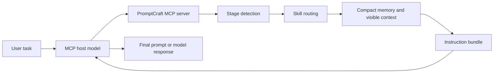

# PromptCraft

[中文文档](README.zh-CN.md)

PromptCraft is a lightweight, MCP-first assistant for stage-aware prompt design.
It helps an MCP host model turn vague, long-running, or high-stakes user tasks
into clearer prompt instruction bundles before the final model response is
generated.

Think of it as a task input enhancement layer. PromptCraft does not try to be a
model, an autonomous Agent framework, or a Python string-concatenation prompt
generator. Its job is narrower: select useful prompting strategies, preserve
compact stage memory, expose only relevant context, and give the host model a
better brief to work from.

## Why This Exists

Modern LLMs are powerful, but many failures still start before inference:

- the user request is underspecified;
- the task spans multiple stages, but each new message loses earlier decisions;
- the model receives too much raw context or too little useful context;
- the user has to manually write expert-level prompts for advanced work;
- debugging prompt behavior becomes messy because task state and generated
  artifacts are scattered.

PromptCraft explores a simple idea: instead of only making the model reason
harder, improve the task brief before the model starts. For complex tasks, a
small amount of structured prompt planning can make the final model interaction
more stable, inspectable, and reusable.

## What PromptCraft Provides

| Capability | What it means |
| --- | --- |
| Stage-aware prompt generation | PromptCraft can distinguish a new task, a stage switch, a repair request, or a need for user confirmation. |
| Prompting Skill routing | It selects from bundled strategies such as zero-shot, few-shot, chain-of-thought, step-back, least-to-most, and tree-of-thought. |
| Compact task memory | It stores stage summaries and durable constraints instead of full chat history. |
| Host-model compaction loop | Raw notes are converted into structured memory by the MCP host model, not by brittle local text rules. |
| MCP-first interface | Codex, Cursor, Claude Code, Windsurf, or another MCP host can call PromptCraft through natural language. |
| Organized artifacts | Generated prompts and task state can be saved into task-specific folders for easier review. |
| Developer CLI | A small CLI exists for local testing, debugging, and regression coverage. |

## How It Works



PromptCraft returns an instruction bundle to the host model. The host model then
uses that bundle to write the final prompt or continue the user-facing task.
This keeps PromptCraft focused on prompt planning and state organization while
leaving natural-language generation to the model that is already serving the
user.

## Project Boundaries

| PromptCraft is | PromptCraft is not |
| --- | --- |
| An MCP tool for task input enhancement | A replacement for the host model |
| A stage memory and prompt planning layer | A full autonomous Agent framework |
| A prompt Skill router | A hidden model-calling service |
| A local Python package with tests | A production SaaS product |

The v0.1 design intentionally keeps the boundary small. PromptCraft does not
call an external model by default. It prepares structured guidance for the MCP
host model and lets the host model generate the final language.

## Quick Start

Install from this repository:

```powershell
pip install .
```

Configure your MCP host with the stdio server:

```json
{
  "mcpServers": {
    "promptcraft": {
      "command": "python",
      "args": ["-m", "promptcraft.mcp_server"]
    }
  }
}
```

Then ask your MCP host in natural language:

```text
Please call PromptCraft and generate a stage-level advanced prompt for the current task.
```

PromptCraft will inspect the task, select a Skill, read compact memory, hydrate
business-relevant context, and return a prompt generation instruction bundle
for the host model.

## Example MCP Call

```json
{
  "task_id": "router-audit",
  "user_request": "Audit router edge cases",
  "output_format": "Actionable engineering review",
  "stage_hint": "auto",
  "skill": "auto",
  "save_prompt": true,
  "output_dir": "outputs"
}
```

A typical generation response contains:

```json
{
  "event": "NEW_STAGE",
  "selected_skill": "step-back",
  "memory_summary": {},
  "visible_context": {},
  "instruction_bundle": {},
  "host_generation_guidance": "..."
}
```

When `save_prompt` is enabled, generated prompt bundles are saved under a
task-specific folder such as `outputs/router-audit/prompt.md`, with task state
stored beside it as `outputs/router-audit/state.json`.

## MCP Tools

PromptCraft exposes eight public tools:

| Tool | Purpose |
| --- | --- |
| `promptcraft_generate_prompt` | Generate a stage-level prompt instruction bundle. |
| `promptcraft_generate_repair_prompt` | Generate a lightweight in-stage repair bundle. |
| `promptcraft_select_skill` | Select the best Skill without generating a bundle. |
| `promptcraft_start_stage` | Archive the previous stage and start a new one. |
| `promptcraft_compact_context` | Return host compaction guidance for raw notes, or normalize structured `StageMemory`. |
| `promptcraft_get_memory` | Read task and stage memory. |
| `promptcraft_update_memory` | Update task-level or stage-level memory. |
| `promptcraft_list_skills` | List bundled Skills and use cases. |

## Bundled Skills

PromptCraft currently includes seven prompt-engineering Skills:

```text
zero-shot
few-shot
zero-shot-cot
few-shot-cot
step-back
least-to-most
tree-of-thought
```

## Compact Context Flow

`promptcraft_compact_context` keeps the v1 boundary honest. PromptCraft does
not pretend that local Python rules can reliably perform semantic summarization.

If the tool receives raw stage notes or conversation text, it returns
`NEEDS_HOST_COMPACTION` with a compaction instruction bundle. The MCP host model
should use that bundle to produce clean `stage_memory` JSON, then call
`promptcraft_update_memory`.

If the tool receives already structured stage fields, it returns
`READY_FOR_MEMORY_UPDATE` with normalized and deduplicated `stage_memory` plus a
ready-to-use `next_tool_call`.

## Developer Notes

The CLI is kept for local debugging and tests. It is not the primary user
experience.

```powershell
python -m promptcraft generate --task "Extract action items" --output-format "JSON" --json
python -m promptcraft generate "tasks\secure-audit-10k\compact_context_input.json" --json
python -m promptcraft compress "tasks\secure-audit-10k\compact_context_input.json"
python -m unittest discover -s tests
```

For cleaner multi-task runs, write prompts into task-specific folders:

```powershell
python -m promptcraft generate --task "Audit router edge cases" --task-id router-audit --out-dir outputs
```

Generated scratch artifacts can be removed after a prompt is produced by
passing explicit cleanup paths:

```powershell
python -m promptcraft generate --task "Extract action items" --cleanup-after-generate --cleanup-path generated_tests --cleanup-path draft_skill\SKILL.md
```

The generated `prompt` in CLI output is a developer-facing MCP instruction
bundle preview. It does not mean PromptCraft executed the user task.

## Windows Development

PowerShell, Python, and JSON tooling can disagree about encodings when the
project path contains Chinese characters or spaces. Before running ad hoc local
debugging commands, set the current PowerShell session to UTF-8:

```powershell
chcp 65001
$env:PYTHONIOENCODING="utf-8"
$env:PYTHONUTF8="1"
```

You can also dot-source the helper script from the repository root:

```powershell
. .\scripts\windows_dev_env.ps1
```

Quote JSON paths that contain spaces, Chinese characters, or text copied from a
chat window:

```powershell
python -m promptcraft generate "tasks\secure-audit-10k\compact_context_input.json" --json
python -m promptcraft compress "tasks\secure-audit-10k\compact_context_input.json"
```

Avoid pasting long multi-line `python -c "..."` snippets into PowerShell. They
can contain hidden non-breaking spaces (`\xa0`). Prefer a temporary `.py` file
for local debugging.

## Repository Layout

```text
promptcraft/
  cli.py                 Developer CLI
  mcp_server.py          MCP stdio server
  service.py             Prompt generation service boundary
  router.py              Skill and event routing
  stage_manager.py       Stage transition logic
  state_store.py         Task and stage memory persistence
  skills/                Bundled prompt-engineering Skills
examples/                MCP and minimal task examples
scripts/                 Local development helpers
tests/                   Unit and regression tests
```

## Status and Roadmap

PromptCraft is currently an early v0.1 prototype. The main focus is validating
the stage-aware prompt planning flow and keeping the implementation small enough
to inspect.

Planned directions:

- richer Skill selection policies;
- better memory inspection and task review tools;
- evaluation examples for advanced task workflows;
- provider-specific MCP integration notes;
- clearer examples for product, research, coding, and writing tasks.

## License

This project is released under the MIT License. See [LICENSE](LICENSE).
