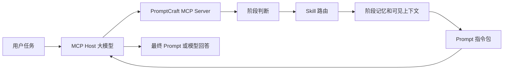

# PromptCraft

[English README](README.md)

PromptCraft 是一个面向 MCP Host 的阶段化 Prompt 设计助手。它帮助宿主大模型在正式生成回答之前，先把模糊、复杂、跨阶段的用户任务整理成更清晰的提示词指令包。

你可以把它理解为一层“任务输入增强层”：它不替代大模型推理，也不做完整 Agent 框架，而是负责选择合适的提示工程策略、保留阶段记忆、压缩上下文，并把更好的任务说明交给宿主模型。

## 为什么做这个项目

很多大模型任务失败，并不完全是模型能力不足，而是输入阶段已经出现问题：

- 用户需求比较模糊，模型不知道应该按什么标准完成；
- 一个任务跨越多个阶段，前面做过的决策在后续对话中逐渐丢失；
- 上下文太多时，模型被噪声干扰；上下文太少时，模型缺少关键约束；
- 高级任务需要复杂 Prompt，但普通用户很难稳定写出来；
- 生成的 Prompt、阶段状态和调试文件分散在不同位置，难以复盘。

PromptCraft 探索的是一个很朴素的方向：在让模型“更努力思考”之前，先把交给模型的任务说明整理好。对于高级任务，少量结构化的提示词规划，可能会让后续交互更稳定、更容易检查，也更容易复用。

## 核心能力

| 能力 | 说明 |
| --- | --- |
| 阶段感知 Prompt 生成 | 判断当前是新任务、阶段切换、阶段内修补，还是需要用户补充信息。 |
| Prompt Skill 路由 | 从 zero-shot、few-shot、CoT、step-back、least-to-most、tree-of-thought 等策略中选择更合适的一种。 |
| 轻量任务记忆 | 保存阶段摘要和长期约束，不保存完整聊天历史。 |
| 宿主模型压缩闭环 | 长文本语义压缩交给 MCP Host 中的大模型完成，本地只负责结构化和存储。 |
| MCP 优先 | 用户可以通过 Codex、Cursor、Claude Code、Windsurf 或其他 MCP Host 自然语言调用。 |
| 任务文件归档 | 同一任务的 Prompt 和状态可以保存到同一个任务文件夹，便于复盘。 |
| 开发者 CLI | 提供本地调试、测试和回归验证入口，但不是主要用户界面。 |

## 工作方式



PromptCraft 返回的是给宿主模型使用的指令包。最终自然语言 Prompt 或模型回答，仍然由宿主大模型生成。这样可以让 PromptCraft 专注于任务规划、阶段记忆和上下文组织，而不是把自己变成另一个模型调用框架。

## 项目边界

| PromptCraft 是 | PromptCraft 不是 |
| --- | --- |
| 面向 MCP 的任务输入增强工具 | 宿主大模型的替代品 |
| 阶段记忆和 Prompt 规划层 | 完整自动化 Agent 框架 |
| Prompt Skill 路由器 | 隐藏的大模型调用服务 |
| 有测试覆盖的本地 Python 包 | 已商业化的生产级 SaaS |

v0.1 版本刻意保持边界清晰：PromptCraft 默认不调用外部大模型，只为 MCP Host 准备结构化提示词指导，让宿主模型完成最终生成。

## 快速开始

在项目目录安装：

```powershell
pip install .
```

在 Codex、Cursor、Claude Code、Windsurf 或其他 MCP Host 中配置：

```json
{
  "mcpServers": {
    "promptcraft": {
      "command": "python",
      "args": ["-m", "promptcraft.mcp_server"]
    }
  }
}
```

然后直接对宿主模型说：

```text
请调用 PromptCraft，为当前任务生成一个阶段级高级提示词。
```

PromptCraft 会完成阶段判断、Skill 选择、阶段记忆读取、业务上下文整理，并返回给宿主模型一个 Prompt 生成指令包。

## MCP 调用示例

```json
{
  "task_id": "router-audit",
  "user_request": "审查路由模块的边界情况",
  "output_format": "可执行的工程审查建议",
  "stage_hint": "auto",
  "skill": "auto",
  "save_prompt": true,
  "output_dir": "outputs"
}
```

典型返回结构：

```json
{
  "event": "NEW_STAGE",
  "selected_skill": "step-back",
  "memory_summary": {},
  "visible_context": {},
  "instruction_bundle": {},
  "host_generation_guidance": "..."
}
```

如果开启 `save_prompt`，同一任务生成的 Prompt 会保存到任务专属文件夹，例如 `outputs/router-audit/prompt.md`，状态文件会保存在同目录的 `state.json` 中。

## MCP 工具

PromptCraft 当前暴露 8 个公共工具：

| 工具 | 作用 |
| --- | --- |
| `promptcraft_generate_prompt` | 生成阶段级 Prompt 指令包。 |
| `promptcraft_generate_repair_prompt` | 生成阶段内轻量修补指令包。 |
| `promptcraft_select_skill` | 只选择 Skill，不生成完整指令包。 |
| `promptcraft_start_stage` | 归档上一阶段并开启新阶段。 |
| `promptcraft_compact_context` | 为长文本返回宿主模型压缩指令，或规范化结构化阶段记忆。 |
| `promptcraft_get_memory` | 读取任务级和阶段级记忆。 |
| `promptcraft_update_memory` | 更新长期约束、用户偏好或阶段记忆。 |
| `promptcraft_list_skills` | 列出内置 Skills 和适用场景。 |

## 内置 Skills

PromptCraft 当前包含 7 个提示工程 Skills：

```text
zero-shot
few-shot
zero-shot-cot
few-shot-cot
step-back
least-to-most
tree-of-thought
```

## Compact Context 闭环

`promptcraft_compact_context` 用来保持 v0.1 的设计边界清晰：PromptCraft 不假装用本地 Python 规则完成复杂语义压缩。

当输入是阶段长文本、对话记录或杂乱笔记时，工具返回 `NEEDS_HOST_COMPACTION` 和一个元压缩指令包。宿主模型根据该指令包提炼出标准 `stage_memory` JSON，然后继续调用 `promptcraft_update_memory` 写入本地状态。

当输入已经是结构化阶段字段时，工具返回 `READY_FOR_MEMORY_UPDATE`，并给出规范化、去重后的 `stage_memory` 和可直接执行的 `next_tool_call`。

## 开发者说明

CLI 只用于开发调试和本地测试，不作为主要使用方式。

```powershell
python -m promptcraft generate --task "提取待办事项" --output-format "JSON" --json
python -m promptcraft generate "tasks\secure-audit-10k\compact_context_input.json" --json
python -m promptcraft compress "tasks\secure-audit-10k\compact_context_input.json"
python -m unittest discover -s tests
```

如果希望多任务产物更整洁，可以把 Prompt 写入任务专属文件夹：

```powershell
python -m promptcraft generate --task "审查路由边界情况" --task-id router-audit --out-dir outputs
```

CLI 输出中的 `prompt` 是给开发者查看的 MCP 指令包预览，不代表 PromptCraft 已经执行了用户任务。

## Windows 开发建议

当项目路径包含中文或空格时，PowerShell、Python 和 JSON 工具可能在编码上不一致。运行临时调试命令前，建议先把当前 PowerShell 会话切换到 UTF-8：

```powershell
chcp 65001
$env:PYTHONIOENCODING="utf-8"
$env:PYTHONUTF8="1"
```

也可以在仓库根目录执行：

```powershell
. .\scripts\windows_dev_env.ps1
```

传入 JSON 路径时，建议把完整路径加双引号：

```powershell
python -m promptcraft generate "tasks\secure-audit-10k\compact_context_input.json" --json
python -m promptcraft compress "tasks\secure-audit-10k\compact_context_input.json"
```

尽量避免从网页或聊天窗口复制多行 `python -c "..."` 到 PowerShell。复制内容中可能混入隐藏的不换行空格 `\xa0`。临时调试更推荐写成一个小 `.py` 文件再运行。

## 仓库结构

```text
promptcraft/
  cli.py                 开发者 CLI
  mcp_server.py          MCP stdio 服务
  service.py             Prompt 生成服务边界
  router.py              Skill 和事件路由
  stage_manager.py       阶段切换逻辑
  state_store.py         任务和阶段记忆持久化
  skills/                内置提示工程 Skills
examples/                MCP 和最小任务示例
scripts/                 本地开发辅助脚本
tests/                   单元测试和回归测试
```

## 项目状态与路线

PromptCraft 目前处于 v0.1 原型阶段。当前重点是验证阶段化 Prompt 规划流程，并保持实现足够小、足够容易检查。

后续可以继续探索：

- 更丰富的 Skill 选择策略；
- 更好用的记忆查看和任务复盘工具；
- 面向高级任务流程的评测样例；
- 不同 MCP Host 的接入说明；
- 产品、研究、编程、写作等场景的示例模板。

## 许可证

本项目使用 MIT License。详见 [LICENSE](LICENSE)。
